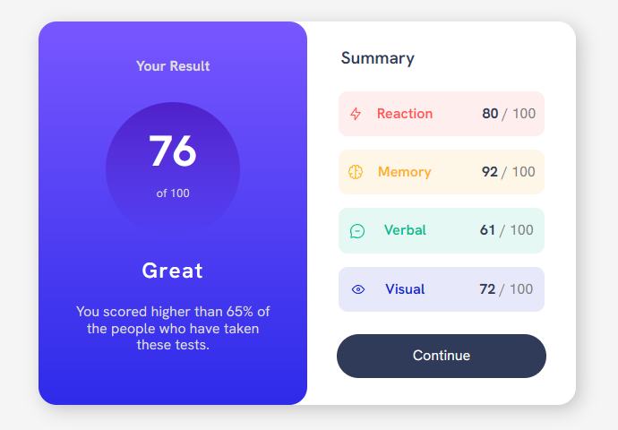

# Frontend Mentor - Results summary component solution

This is a solution to the [Results summary component challenge on Frontend Mentor](https://www.frontendmentor.io/challenges/results-summary-component-CE_K6s0maV). Frontend Mentor challenges help you improve your coding skills by building realistic projects. 

## Table of contents

- [Overview](#overview)
  - [The challenge](#the-challenge)
  - [Screenshot](#screenshot)
  - [Links](#links)
- [My process](#my-process)
  - [Built with](#built-with)
  - [What I learned](#what-i-learned)
- [Author](#author)

## Overview

### The challenge

Users should be able to:

- View the optimal layout for the interface depending on their device's screen size
- See hover and focus states for all interactive elements on the page
- **Bonus**: Use the local JSON data to dynamically populate the content

### Screenshot

### Links

- Solution URL HTML: [HTML](https://github.com/ZahidurRahman8759/Results-Summary/blob/4df2dcb5edce064f288f390ccbd0e1804a2788c3/index.html)
- Solution URL CSS: [CSS](https://github.com/ZahidurRahman8759/Results-Summary/blob/4df2dcb5edce064f288f390ccbd0e1804a2788c3/style.css)
- Live Site URL: [LIVE](https://zahidurrahman8759.github.io/Results-Summary/)

## My process

### Built with

- HTML5
- CSS custom properties
- Flexbox
- Mobile-first workflow (500px)

### What I learned

By creating this project I have learned so much about flexbox. Good way to practice your flexbox skill.

## Author

- Frontend Mentor - [@ZahidurRahman8759](https://www.frontendmentor.io/profile/ZahidurRahman8759)
